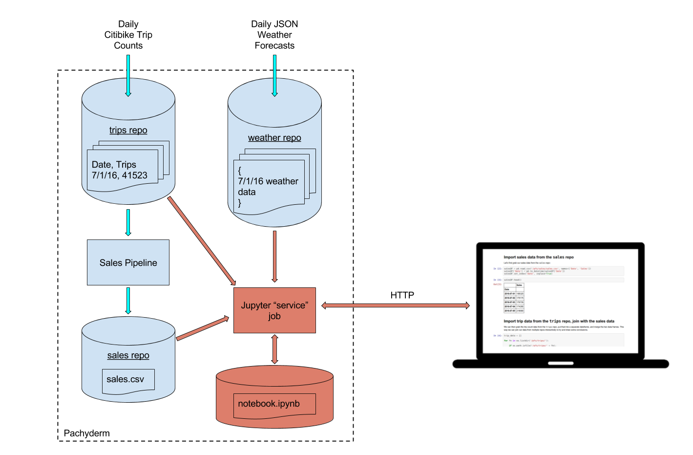
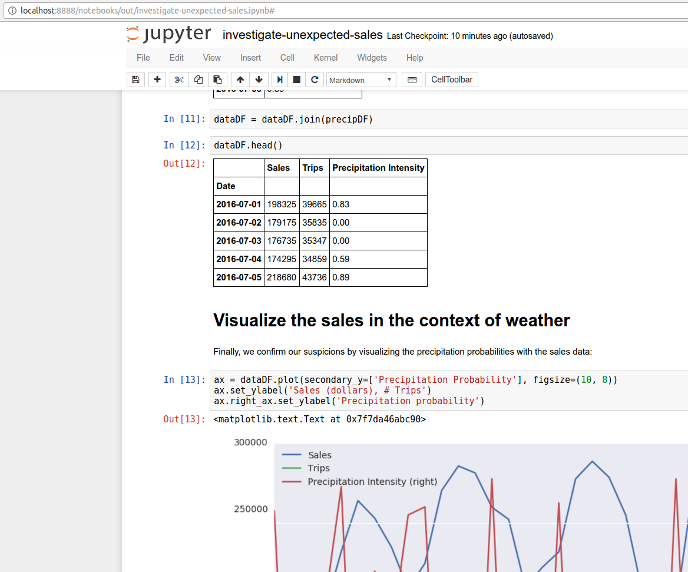
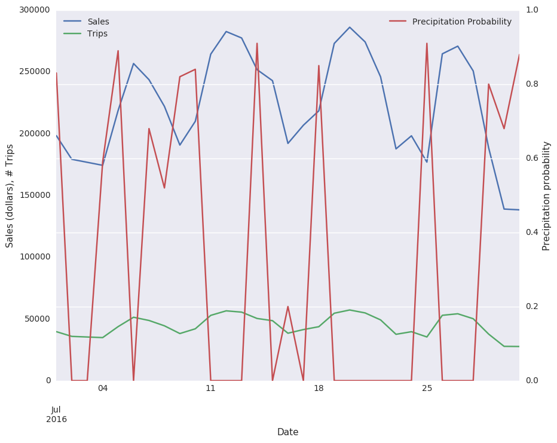

# Jupyter Notebook using versioned Pachyderm Data

In the following example, we will attach a Jupyter server to Pachyderm such that we can manipulate versioned data sets interactively.  Specifically, we will attach our Jupyter server to three different repositories used in an example Pachyderm pipeline:

- **trips** - This repo is populated with a daily file that records the number of bicycle trips recorded by NYC's citibike bike sharing company on that particular day (data from [here](https://www.citibikenyc.com/system-data)).
- **sales** - This repo includes a single CSV file called `sales.csv`.  `sales.csv` is updated daily by a pipeline that processes each file in `trips` to calculate sales for the day.  Note, here we are using a fictional multiplier, $5/trip, to calculate daily "sales" (i.e., these are not actually the sales figures for citibike).
- **weather** - This repo is populated daily with a JSON file representing the weather forecast for that day from [forecast.io](https://darksky.net/forecast/40.7127,-74.0059/us12/en).

We attach to the trips and weather repos at commit number 30, which corresponds to the data versioned on 7/31/2016. We did this, because on 7/30/2016 and 7/31/2016 we saw a sharp drop in our sales, and we want to try and understand, interactively, why we might have seen this drop in sales.


By attaching to these separate points in our DAG (trips, weather, and sales) we can bring our data together at a particular commit (i.e., a particular point in history), without explicitly planning a pipeline stage that takes these repos as input.



Here is the process:

1) Create the data we are going to access with Jupyter:

```
make prep
```

2) Determine the output commit we are going to access with Jupyter:

```
pachctl flush-commit -f trips/master/30
```

and replace the `<output-commitid>` in `jupyter.json` with the sales repo commitid shown. 

3) Deploy a Jupyter Notebook using a Pachyderm "service":

Note the `jupyter.json` file in this directory. We use a standard jupyter docker image (jupyter/scipy-notebook), and run the Jupyter notebook webserver as part of the Pachyderm transform. However, you could attach any libraries, application, etc. by specifying an image you are already using.

Just like a normal Pachyderm Job, a container is created with a specific version of any data sets loaded into the container's filesystem.  In this case we'll see data under `/pfs/trips`, `/pfs/weather`, and `/pfs/sales` at the commits specified in the job specification.

To deploy the service:

```
pachctl create-job -f jupyter.json
```

4) Access Jupyter at `http://localhost:8888` in a browser.  You will see that you have access to the three repos mentioned above plus `/pfs/out`:


You can explore these in the Jupyter file browser and any notebooks created will have access to the data in these repos.

In some cases (e.g., when using minikube or when you want to connect directly to a node vis an IP address), you might need to perform addition port forwarding with, for example, `kubectl port-forward`.

5) Open the `/pfs/out` location in the Jupyter file browser, then select `Python 2` under `New` in the upper right hand corner of Jupyter to create a new Jupyter notebook.  You can then explore, manipulate, and visualize PFS data to your heart's content.  See [our example notebook](investigate-unexpected-sales.ipynb) for some inspiration.  



Specifically, to "debug" why we are seeing the poor sales on 7/30 and 7/31, you can do the following (the details of which can be found in [our example notebook](investigate-unexpected-sales.ipynb)):

- Import the sales data from `/pfs/sales/sales.csv` into a pandas dataframe.

- Merge this sales data with the trips data in `/pfs/trips/`.  From this merged dataframe we can see that both sales and the count of trips were low on 7/31 and 7/30.

- Import the weather data from `/pfs/weather/`.  Try to match up the daily precipitation percentages in the weather data files with the daily sales numbers.  You can create another dataframe that will hold the precipitation percentages, and this new dataframe can be merged with your previously created sales dataframe.

- Now that all the data is merged together, create a plot of daily sales and overlay the precipitation percentages.  This will confirm that, on the days in questions, there was a 70%+ chance of rain, and this is likely the reason for poor bike sharing sales.  Mystery solved!  Here is the graph that we created:


